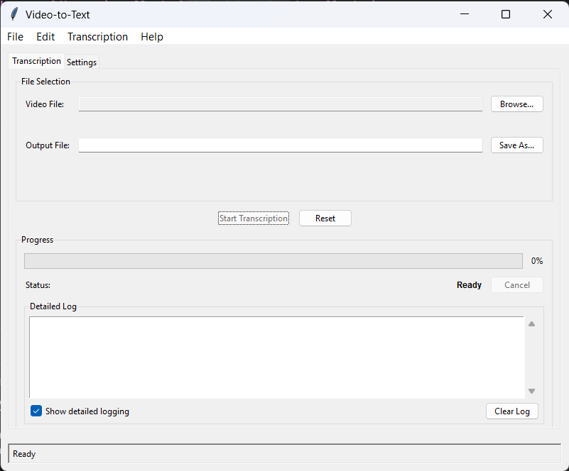

# Video2Text - Cross-Platform Video Transcription GUI

[](https://python.org)
[](LICENSE)
[](https://github.com/HelllGuest/video-to-text-gui)
[](https://github.com/HelllGuest/video-to-text-gui)

A professional, cross-platform desktop application for converting video files to text transcripts using advanced speech recognition technology. Built with Python and Tkinter, Video2Text provides an intuitive graphical interface for transcribing audio content from video files with real-time progress tracking, comprehensive error handling, and support for multiple output formats.

## 🎯 Overview

Video2Text is designed to simplify the process of extracting text from video content. Whether you're working with educational videos, interviews, presentations, or any other video content containing speech, this application provides a powerful yet user-friendly solution for transcription.

### Core Capabilities

- **Video Processing**: Extract audio from multiple video formats (MP4, AVI, MOV, MKV, WMV, FLV, WebM, 3GP, OGV, TS, MTS, M2TS)
- **Speech Recognition**: Convert speech to text using Google's Speech Recognition API
- **Real-time Progress**: Monitor transcription progress with detailed status updates
- **Multiple Output Formats**: Save transcripts as plain text (.txt) or structured JSON with metadata
- **Cross-platform Support**: Native experience on Windows, macOS, and Linux
- **Memory Optimization**: Efficient processing of large video files with automatic cleanup
- **Error Recovery**: Comprehensive error handling with user-friendly messages

## ✨ Key Features

### User Interface
- **Intuitive GUI**: Clean, organized interface with logical panel layout
- **File Selection**: Easy browsing and validation of video files
- **Configuration Panel**: Customizable settings for output format and processing options
- **Progress Monitoring**: Real-time progress bars and detailed status messages
- **Results Display**: Clear presentation of transcription results with export options

### Video Processing
- **Format Support**: 12+ video formats including popular codecs
- **Audio Extraction**: Automatic audio track extraction and processing
- **Quality Preservation**: Maintains audio quality during processing
- **Large File Handling**: Efficient processing of files up to several gigabytes

### Transcription Engine
- **Google Speech Recognition**: Industry-leading accuracy for speech-to-text conversion
- **Language Support**: Automatic language detection and support for multiple languages
- **Noise Handling**: Robust processing of various audio qualities and background noise
- **Timing Information**: Optional timestamp inclusion in output

### Output Options
- **Plain Text (.txt)**: Simple, readable transcript format
- **Structured JSON**: Rich format with metadata including:
  - Word count, character count, and processing time
  - Audio duration and quality metrics
  - Processing statistics and performance data
  - Error logs and warnings
  - Format version for compatibility

### Performance Features
- **Background Processing**: Non-blocking UI with cancellation support
- **Memory Management**: Automatic garbage collection and resource cleanup
- **Progress Throttling**: Optimized GUI updates for responsive interface
- **Temporary File Management**: Automatic cleanup of processing artifacts

## 🖼️ Screenshots

<details>
<summary><strong>📸 Click to show/hide screenshots</strong></summary>

### Main Window



</details>

## 🏗️ Architecture

Video2Text follows a clean, modular architecture with clear separation of concerns:

```
video-to-text-gui/
├── app/                    # Main application package
│   ├── core/              # Core models and interfaces
│   │   ├── models.py      # Data models and structures
│   │   └── interfaces.py  # Abstract interfaces for DI
│   ├── gui/               # User interface components
│   │   ├── app.py         # Main application controller
│   │   ├── main_window.py # Primary window and layout
│   │   ├── file_selection_panel.py  # File selection UI
│   │   ├── configuration_panel.py   # Settings configuration
│   │   ├── progress_panel.py        # Progress tracking
│   │   └── results_panel.py         # Results display
│   ├── services/          # Business logic layer
│   │   ├── transcription_service.py     # Core transcription
│   │   └── transcription_controller.py  # Orchestration
│   └── utils/             # Utility modules
│       ├── error_handler.py      # Error management
│       ├── file_manager.py       # File operations
│       ├── settings_manager.py   # Configuration
│       ├── validation.py         # Input validation
│       ├── performance_monitor.py # Resource monitoring
│       ├── platform_utils.py     # Cross-platform utils
│       └── version_info.py       # Application metadata
├── main.py               # Application entry point
├── requirements.txt      # Python dependencies
└── LICENSE              # MIT License
```

### Component Architecture

#### Core Layer
- **Models**: Data structures for transcription requests, results, and settings
- **Interfaces**: Abstract base classes enabling dependency injection and testability

#### GUI Layer
- **Modular Panels**: Separate components for different UI sections
- **Event-Driven**: Callback-based communication between components
- **Cross-Platform**: Native look and feel on all supported platforms

#### Services Layer
- **Transcription Service**: Handles video processing and speech recognition
- **Controller**: Manages threading, progress reporting, and error handling

#### Utilities Layer
- **Error Handling**: Centralized error management with user-friendly messages
- **File Management**: Robust file operations with validation and cleanup
- **Performance Monitoring**: Resource usage tracking and optimization
- **Platform Utils**: Cross-platform compatibility utilities

## 🚀 Installation

### Prerequisites

- **Python 3.8 or higher**
- **Internet connection** (required for Google Speech Recognition API)
- **FFmpeg** (required for video processing)

### FFmpeg Installation

FFmpeg is essential for video processing. Install it before running the application:

#### Windows
1. **Download FFmpeg** from [https://ffmpeg.org/download.html](https://ffmpeg.org/download.html)
2. **Extract** the archive to `C:\ffmpeg`
3. **Add to PATH**: Add `C:\ffmpeg\bin` to your system PATH environment variable
4. **Verify installation**: Open Command Prompt and run `ffmpeg -version`

**Alternative (using Chocolatey):**
```cmd
choco install ffmpeg
```

#### macOS
**Using Homebrew (recommended):**
```bash
brew install ffmpeg
```

**Using MacPorts:**
```bash
sudo port install ffmpeg
```

#### Linux
**Ubuntu/Debian:**
```bash
sudo apt update
sudo apt install ffmpeg
```

**CentOS/RHEL/Fedora:**
```bash
# CentOS/RHEL
sudo yum install ffmpeg

# Fedora
sudo dnf install ffmpeg
```

**Arch Linux:**
```bash
sudo pacman -S ffmpeg
```

### Application Installation

1. **Clone the repository:**
   ```bash
   git clone https://github.com/HelllGuest/video-to-text-gui.git
   cd video-to-text-gui
   ```

2. **Create a virtual environment:**
   ```bash
   python -m venv .venv
   
   # Windows
   .venv\Scripts\activate
   
   # macOS/Linux
   source .venv/bin/activate
   ```

3. **Install dependencies:**
   ```bash
   pip install -r requirements.txt
   ```

4. **Verify FFmpeg installation:**
   ```bash
   ffmpeg -version
   ```
   If this command fails, please install FFmpeg using the instructions above.

5. **Run the application:**
   ```bash
   python main.py
   ```

## 📖 Usage Guide

### Basic Workflow

1. **Launch the Application**
   ```bash
   python main.py
   ```

2. **Select Your Video File**
   - Click "Browse" next to "Video File"
   - Choose from supported formats: MP4, AVI, MOV, MKV, WMV, FLV, WebM, M4V, 3GP, OGV, TS, MTS, M2TS
   - The application will validate the file and display its properties

3. **Choose Output Location**
   - Click "Browse" next to "Output File"
   - Select where to save your transcript
   - Choose the desired file extension (.txt or .json)

4. **Configure Settings**
   - **Output Format**: Choose between TXT (plain text) or JSON (with metadata)
   - **Verbose Mode**: Enable for detailed processing information
   - **Language**: Select specific language for better accuracy (optional)

5. **Start Transcription**
   - Click "Start Transcription"
   - Monitor progress in real-time
   - View results when complete
   - Export or save the transcript

### Advanced Features

#### Settings Panel
- **Default Output Format**: Set your preferred transcript format
- **Verbose Logging**: Enable detailed processing information
- **Directory Memory**: Application remembers your last used folders
- **Window Preferences**: Size and position are automatically saved

#### Progress Monitoring
- **Real-time Progress Bar**: Visual indication of completion percentage
- **Status Messages**: Detailed information about current processing step
- **Performance Metrics**: Memory usage and processing statistics (in verbose mode)
- **Cancellation Support**: Stop processing at any time

#### Error Handling
- **User-Friendly Messages**: Clear explanations of any issues
- **Suggested Solutions**: Helpful tips to resolve problems
- **Automatic Recovery**: Graceful handling of network or file issues
- **Detailed Logging**: Comprehensive logs for troubleshooting

## 🔧 Technical Details

### Dependencies

#### Core Dependencies
- **moviepy** (≥1.0.3) - Video processing and audio extraction
- **SpeechRecognition** (≥3.10.0) - Speech-to-text conversion
- **pyaudio** (≥0.2.11) - Audio processing support
- **pydub** (≥0.25.1) - Additional audio format support
- **psutil** - System resource monitoring

#### Development Dependencies
- **pyinstaller** (≥5.13.0) - Executable building
- **pytest** (≥7.4.0) - Testing framework
- **pytest-cov** (≥7.4.0) - Test coverage

### Supported Formats

#### Input Video Formats
| Format | Extension | Description | Codec Support |
|--------|-----------|-------------|---------------|
| MP4 | `.mp4`, `.m4v` | MPEG-4 Video | H.264, H.265, MPEG-4 |
| AVI | `.avi` | Audio Video Interleave | Various codecs |
| MOV | `.mov` | QuickTime Movie | H.264, ProRes, etc. |
| MKV | `.mkv` | Matroska Video | Multiple codecs |
| WMV | `.wmv` | Windows Media Video | WMV codecs |
| FLV | `.flv` | Flash Video | H.264, VP6 |
| WebM | `.webm` | WebM Video | VP8, VP9 |
| 3GP | `.3gp` | 3GPP Video | H.263, H.264 |
| OGV | `.ogv` | Ogg Video | Theora |
| TS/MTS | `.ts`, `.mts`, `.m2ts` | Transport Stream | H.264, H.265 |

#### Output Formats
- **TXT**: Plain text transcript with optional timestamps
- **JSON**: Structured format with comprehensive metadata:
  - Transcription text and confidence scores
  - Processing time and performance metrics
  - Audio duration and quality information
  - Error logs and warnings
  - System resource usage data

### Performance Features

- **Memory Optimization**: Automatic garbage collection and resource management
- **Chunked Processing**: Large files processed in segments to prevent memory issues
- **Background Threading**: Non-blocking UI with cancellation support
- **Progress Throttling**: Optimized GUI updates to maintain responsiveness
- **Temporary File Management**: Automatic cleanup of processing artifacts

### Cross-Platform Support

#### Windows
- Native Windows styling and fonts (Segoe UI)
- Windows-specific file dialogs and paths
- DPI awareness for high-resolution displays
- Windows installer support

#### macOS
- Aqua theme integration
- macOS-specific file dialogs
- Retina display support
- App bundle creation

#### Linux
- GTK theme compatibility
- Linux package formats (AppImage, DEB, RPM)
- Desktop integration
- Distribution-specific optimizations

## 🛠️ Development

### Setting Up Development Environment

1. **Clone and setup:**
   ```bash
   git clone https://github.com/HelllGuest/video-to-text-gui.git
   cd video-to-text-gui
   python -m venv .venv
   source .venv/bin/activate  # or .venv\Scripts\activate on Windows
   pip install -r requirements.txt
   ```

2. **Run in development mode:**
   ```bash
   python main.py
   ```

### Building Executables

The project includes automated builds for creating standalone executables:

#### GitHub Actions (Recommended)

The project uses GitHub Actions to automatically build cross-platform binaries:

1. **Automatic builds** on tag pushes:
   ```bash
   git tag v1.0.0
   git push origin v1.0.0
   ```

2. **Manual builds** via GitHub Actions UI:
   - Go to Actions → "Build Cross-Platform Binaries"
   - Click "Run workflow"

3. **Download binaries** from:
   - GitHub Releases (for tagged builds)
   - Actions artifacts (for manual builds)

#### Local Development

For local development and testing:

```bash
# Install PyInstaller
pip install pyinstaller

# Build for current platform
pyinstaller --onefile --name video2text main.py

# Binary will be created in dist/video2text (or video2text.exe on Windows)
```

For more detailed build instructions, see [BUILD.md](BUILD.md).

### Testing

```bash
# Run tests
pytest

# Run with coverage
pytest --cov=app tests/
```

## 🤝 Contributing

We welcome contributions! Please see our contributing guidelines:

1. **Fork the repository**
2. **Create a feature branch**: `git checkout -b feature/amazing-feature`
3. **Make your changes** with proper tests
4. **Commit your changes**: `git commit -m 'Add amazing feature'`
5. **Push to the branch**: `git push origin feature/amazing-feature`
6. **Open a Pull Request**

### Development Guidelines

- Follow PEP 8 style guidelines
- Add tests for new functionality
- Update documentation for API changes
- Ensure cross-platform compatibility
- Use type hints where appropriate

## 📝 License

This project is licensed under the MIT License - see the [LICENSE](LICENSE) file for details.

## 🆘 Support

### Common Issues

**"Import Error" when starting:**
- Ensure all dependencies are installed: `pip install -r requirements.txt`
- Check Python version (3.8+ required)

**FFmpeg-related errors:**
- **"Couldn't find ffmpeg or avconv"**: Install FFmpeg using the instructions above
- **"MoviePy error"**: Verify FFmpeg is in your system PATH
- **Video processing fails**: Try converting your video to MP4 format first
- **Audio extraction errors**: Ensure FFmpeg supports your video codec

**"No audio track found":**
- Verify the video file contains audio
- Try a different video file format
- Check if the video has multiple audio tracks

**"Network error" during transcription:**
- Check internet connection (required for Google Speech Recognition)
- Verify firewall settings allow the application
- Try again later if Google's service is temporarily unavailable

**"Permission denied" errors:**
- Check file permissions
- Try running as administrator (Windows) or with sudo (Linux/macOS)
- Ensure output directory is writable

**Large file processing issues:**
- Ensure sufficient disk space for temporary files
- Close other applications to free up memory
- Try processing smaller video segments

### Getting Help

- **Issues**: Report bugs or request features on GitHub Issues
- **Discussions**: Join community discussions on GitHub Discussions
- **Documentation**: Check the wiki for detailed guides

### System Requirements

- **Operating System**: Windows 10+, macOS 10.14+, or Linux (Ubuntu 18.04+)
- **Python**: 3.8 or higher
- **Memory**: 4GB RAM minimum, 8GB recommended for large files
- **Storage**: 100MB for application, additional space for temporary files
- **Network**: Internet connection required for speech recognition

## 🎉 Acknowledgments

- **Google Speech Recognition API** for speech-to-text conversion
- **MoviePy** team for excellent video processing capabilities
- **Python community** for the amazing ecosystem of libraries
- **Contributors** who help improve this project

---
